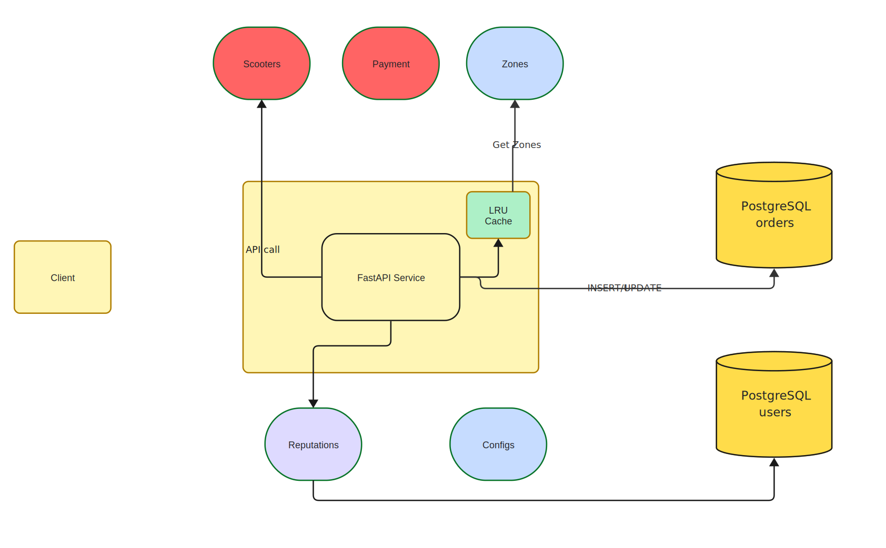

# Архитектура для сервиса аренды самокатов

Статус: Draft / v1
Team: Багдасарян Анри Аркадьевич, Лукацкий Илья Алексеевич, Туруллин Захар Дмитриевич, Шарапова Лияна Айратовна

---

## 1. Scope и Domain

**Scope**

- Сервис аренды самокатов:
  - создание оффера,
  - создание заказа (старт поездки),
  - завершение заказа (финиш поездки),
  - получение информации о заказе и текущей стоимости.
- Работаем на уровне **одного backend-сервиса**, одной основной БД и одного кеша.
- Внешние зависимости: `scooters`, `users`, `zones`, `configs`, `payments`.

**Domain**

- Приложение, через которое пользователь:
  - выбирает самокат и тариф,
  - получает оффер,
  - начинает поездку,
  - получение текущей информации по заказу (например, стоимость)
  - завершает поездку и оплачивает её.
- Бизнес-ограничения:
  - нужно учитывать долги пользователя и его “надёжность”;
  - офферы должны быть "свежими";
  - часть источников данных критична (scooters, payments), часть — допускают деградации (users, configs, zones).

**Коротко о выбранных технологиях**:
- База данных: PostgreSQL с партиционированием таблицы `orders` по дате создания.
- Кеш: in-memory LRU (готовая реализация), держим активные заказы и конфигурационные данные.
- Сервис: Python (FastAPI) со слоями API/домен/хранилища/клиенты.

---

## 2. Технические цели

### 2.1. Функциональные требования (FR)

1. Создание оффера (POST `/offers`): синхронно рассчитать цену по самокату/зоне/тарифу; результат включает открытый оффер для UI и проверяемый токен, который защищает от подделки и срок действия. Повторные вызовы допускаются (лимитер вне скоупа); Идемпотентна из определения; ручка stateless.
2. Создание заказа (POST `/orders`): создание заказа из ранее выданного оффера при условии валидного/непросроченного токена; обязательная проверка актуальности пользователя/самоката/зоны/конфигов и бизнес-ограничений по поездке; идемпотентность по клиентскому ключу; ручка statefull.
3. Завершение заказа (POST `/orders/{id}/finish`): расчёт финальной стоимости по фактическим данным, завершение заказа и инициирование платежа с возвратом статуса оплаты; идемпотентность по клиентскому ключу; обновляет состояние order в базе данных.
4. Получение информации о заказе (GET `/orders/{id}`): вернуть состояние заказа, текущую/финальную стоимость и статус оплаты.
5. Свежесть оффера: слишком старые (> 5 мин - конфигурируемо) оффера отклоняются, клиенту предлагается запросить новый оффер.
6. Учёт долгов и надёжности: старт блокируется при долге > 0; для новых/ненадёжных пользователей применяются усиленные проверки/ограничения (просим внести депозит, делаем предпроверки оплаты); решения принимаются на основе агрегированного профиля пользователя.
7. Интеграции с внешними сервисами: при старте/финише и расчётах используются `scooters`, `users`, `zones`, `configs`, `payments`.

---

### 2.2. Нефункциональные требования (NFR)

**Исходные параметры задачи**

- `X = 20` — RPS на создание заказов (старт поездки).
- `Y = 50` — среднее число показов информации о заказе на один заказ.
- `Z = 10 КБ` — средний размер записи о заказе в БД.
- Хранение данных — до 5 лет (влияет на расчёт ресурсов, не обязательно всё держать “горячим”).

1. **Производительность / нагрузка**
   - Оценка RPS: ~`X = 20 RPS` создание заказов, ~`20 RPS` завершение, ~`1000 RPS` GET `/orders/{id}`, `/offers` до `40 RPS` (считаем что 50% офферов превращается в заказ).
   - Обращение к базе данных: ожидается ~1100 чтений/сек (1000 + возможные чтения при создание и завершение заказа), кеш должен снимать большую долю GET `/orders/{id}`, то есть примерно 800 чтений/сек на кеш, тогда на базу ожидается в районе 300 RPS.
2. **Хранение**
   - “Горячее” (оперативные) данные — ~30 дней в основной БД.
   - Общий горизонт хранения — 5 лет (архив/отдельное хранилище).
3. **Надёжность и доступность (Reliability)**
   - SLA/SLO: целимся в 99.9% для старт/финиш заказов.
   - Критичные зависимости: `scooters`, `payments` — при недоступности отказываем в обслуживание с сообщением попробовать чуть позже.
   - Некритичные: `users`, `configs`, `zones` — работаем через кеш/статический конфиг/последний профиль в ограниченном режиме.
4. **Масштабируемость (Scalability)**
   - Горизонтальное масштабирование API и кеш-слоя; партиционирование `orders`, stateless `/offers` снижает нагрузку на хранилища.
5. **Поддерживаемость (Maintainability)**
   - Чёткое разделение слоёв: http, бизнес-логика, репозитории по работе с данными (базы данных, кеш), клиенты для внешних api.
   - Возможность выделить модули в отдельные сервисы позже без массового переписывания.
   - Встраивание базы данных и кеша через DI.
   - Надежные тесты и хорошее coverage
6. **Наблюдаемость (Observability)**
   - Логирование основных этапов в коде.
   - Метрики: латентности/успехи по ручкам, RPS, error rate, доля кеш-хитов GET `/orders/{id}`, время внешних вызовов, доля успешных платежей, конверсия offers->orders, отказы по скорингу; логирование расчётов офферов и платежных операций.

---

## 3. Архитектура

### 3.1. Схема

https://miro.com/app/board/uXjVJi7nJ4k=/?share_link_id=63911490447

### 3.2. Компоненты и логика

#### HTTP API сервис
- **Подробное описание**: FastAPI-сервис с ручками `/offers`, `/orders`, `/orders/{id}`, `/orders/{id}/finish`; слои: http routing, доменные бизнес-логика, репозитории (PostgreSQL + кеш), HTTP-клиенты к внешним сервисам, вспомогательные utils. Stateless для `/offers`, stateful для `/orders`.
- **Расчёт нагрузки и требования по CPU, RAM и диску**:  
  - RPS: POST `/offers` ~40 (X*2, 50% офферов становятся заказами), POST `/orders` ~20 (X), POST `/orders/{id}/finish` ~20 (X), GET `/orders/{id}` ~1000 (X*Y=20*50). Итог: ~80 write-RPS и ~1000 read-RPS на один инстанс.  
  - CPU: считаем CPU-bound часть ~3 мс на запрос (валидация+JWT+логика; I/O вынесено во внешние вызовы/БД). При 1080 RPS * 0.003 это ~3.24 CPU-сек/сек -> укладывается в 4 vCPU с ~80% загрузкой и запасом на пики. Стартуем **1 инстанс** 4 vCPU; масштабируем до 2–3 при росте RPS или удлинении логики.  
  - RAM: при 1 инстансе берём 12 ГБ как бюджет с запасом под временные аллокации.  
  - Диск: только логи/образ, 128 ГБ SSD на инстанс достаточно; состояние не хранится. Под логи с учетом ротации в пару дней нужно 1080 * 0.1 кб * 10 * 3600 * 24 ≈ 90 GB
- **Логика работы**:  
  - `/offers`: чистая функция расчёта цены, выдаёт оффер и проверяемый токен со сроком жизни; обращается к сервису репутации за параметрами риска пользователя.  
  - `/orders`: валидация токена оффера, проверка пользователя/самоката/зоны/конфигов и долгов (через сервис репутации), транзакционный write `orders` + обновление `user_summary`; идемпотентность по Idempotency-Key (уникальный ключ + запись результата в кеш).  
  - `/orders/{id}`: читаем из кеша; при miss — из БД. Кешируем активный заказ и небольшой хвост после завершения (конфигурируемый TTL).  
  - `/orders/{id}/finish`: пересчёт финальной цены по факту, обновление заказа и агрегатов, инициирование платежа; идемпотентность по Idempotency-Key; обновление профиля/долгов через сервис репутации.  
  - Метрики и логи: latency/успехи по ручкам, error rate, кеш-хиты, внешние тайминги, платежная конверсия, бизнес-события start/finish/payment status.
- **Альтернативы (C + / - и решениями)**:  
  - Держать логику долгов/репутации внутри основного сервиса. **Плюсы**: меньше внешних вызовов. **Минусы**: нет изоляции и отдельного SLA, сложнее обновлять и наращивать правила. **Решение**: используем вынесенный сервис репутации; вернём внутрь только если RPS или задержки сервиса станут bottleneck.  
  - Stateful `/offers` с хранением `offer_id` в БД/кеше. **Плюсы**: простая валидация на `/orders`, аудит рядом. **Минусы**: write-нагрузка и инвалидация, сложнее деградация. **Решение**: stateless офферы + логирование расчётов; при росте требований к аудиту можно добавить хранилище офферов.
- **Деградация**: при падении узла — теряем все ручки, поэтому в перспективе нужно минимум 2 инстанса за балансировщиком, пока оставляем 1 инстанс.

#### База данных (PostgreSQL)
- **Подробное описание**: основная транзакционная БД; таблицы `orders` (партиционирование по дате создания), `user_summary` (агрегаты долгов/рейдов), офферы stateless. Реплика/шардирование пока опционально.
- **Расчёт нагрузки и требования по CPU, RAM и диску**:  
  - Writes: `orders` ~20 INSERT + 20 UPDATE = ~40 оп/сек, `user_summary` до ~40 UPDATE/сек -> ~80 write/сек.  
  - Reads: создание ~20/сек, завершение ~24/сек, GET miss ~200/сек -> ~244 read/сек. При 10 КБ/операцию это ~2.4 МБ/с чтения и ~0.8 МБ/с записи -> SSD с запасом.  
  - Объём: X=20 -> ~1.7M заказов/день (~16.5 ГБ/день), ~0.5 ТБ за 30 дней горячих данных, ~5.8 ТБ/год, ~29 ТБ за 5 лет.  
  - CPU: путь write/commit ~2–3 мс, при 80 write/сек это ~0.24 CPU-сек/сек; чтения ~244*1 мс = ~0.24 CPU-сек/сек. В сумме <1 vCPU, остальное — на background и vacuum -> 8 vCPU с большим запасом.
  - Конфигурация и инстансы: стартуем инстанс 8 vCPU, 32 ГБ RAM, NVMe ~32 ТБ, партиционирование по дням. При росте — добавить 1–2 реплики на чтение и масштабировать storage/CPU.  
- **Логика работы**: ACID-транзакции при создании/завершении, идемпотентность через уникальные ключи/idempotency key, партиционирование `orders` по времени, регулярный вакуум/maintenance, индексы по `order_id`, `user_id`, `created_at`.
- **Альтернативы (C + / - и решениями)**:  
  - SQLite. **Плюсы**: простое развёртывание. **Минусы**: слабая конкурентность, нет партиционирования/реплик. **Решение**: остаёмся на PostgreSQL.  
  - NoSQL (MongoDB/Cassandra). **Плюсы**: горизонтальная масштабируемость. **Минусы**: нет привычной транзакционности, сложнее идемпотентность и ограничения. **Решение**: реляционная модель на PostgreSQL закрывает требования.  
  - Хранить всё in-memory. **Плюсы**: низкая латентность. **Минусы**: риск потери данных, сложность соблюдения долговременного хранения. **Решение**: не подходит под 5-летний горизонт.
- **Деградация**: PostgreSQL критичен — при недоступности блокируем создание/завершение заказов с быстрым 503; GET отдаём из кеша до истечения TTL, при miss сразу 503. При деградации диска/CPU — временно увеличиваем TTL кеша и снижаем лимиты на write-ручки.

#### Кеш (in-memory, LRU на том же хосте)
- **Подробное описание**: локальный LRU-кеш в процессе сервиса (или sidecar) для заказов, тарифных зон и конфигов. Нужен для снятия нагрузки с БД и снижения латентности GET `/orders/{id}`; хранит только короткоживущие данные.
- **Расчёт нагрузки и требования по CPU, RAM и диску**:  
  - Для заказов: 20 RPS * ttl_sec * 5 КБ * 1.2 -> целевой TTL ~2 часа ≈ 844 МБ (для справки: 1/2/4 часа ≈ 422/844/1688 МБ); при росте до 40 RPS и TTL ~2 часа — ~1.7 ГБ.  
  - Зоны: 5–10 КБ на запись, 5k–10k зон -> 10–20 МБ. Конфиги: <1 МБ.  
  - Итого по узлу: ~865 МБ при 20 RPS и целевом TTL ~2 часа (для справки: ~0.85 ГБ на 2 часа, ~1.7 ГБ на 4 часа); при росте до 40 RPS и TTL ~2 часа — ~1.8 ГБ. Резервируем ≥2 ГБ на кеш. CPU — O(1) операции, пренебрежимо; диск не используется. Один кеш-инстанс на каждый инстанс приложения (локально).
- **Логика работы**: кеш заказов с TTL и ограничением по размеру; кешируем активную поездку + хвост после завершения. `zones` — LRU + TTL 10 минут (read-only), `configs` — периодический fetch (до 1 раза в минуту) с локальным статическим fallback. Хиты ~800 RPS, миссы ~300 RPS уходят в БД.
- **Альтернативы (C + / - и решениями)**:  
  - Внешний Redis/KeyDB/Memcached. **Плюсы**: общий кеш между инстансами, отдельное масштабирование. **Минусы**: сетевые RTT, новая точка отказа, доп. инфраструктура. **Решение**: стартуем с локального кеша; внешний включаем при росте числа инстансов или RPS.  
  - Отказ от кеша. **Плюсы**: простота. **Минусы**: нагрузка на БД до ~1100 RPS, рост латентности. **Решение**: кеш обязателен для соблюдения SLA.
- **Деградация**: при отказе кеша GET `/orders/{id}` идут в БД -> рост латентности; включаем консервативные лимиты, наблюдаем за БД, для `zones/configs` используем статический fallback. При переполнении — агрессивная эвикция и сокращение TTL.

#### Модуль репутации пользователей (risk/billing)
- **Подробное описание**: сейчас реализован как модуль внутри основного сервиса, работает поверх внешнего `users` и локальных кешей. Выдаёт параметры риска для оффера (мультипликатор цены, нужен ли залог, нужен ли pre-check) и обновляет профиль после завершения заказа.  
  При росте нагрузки или требований по изоляции модуль может быть вынесен в отдельный сервис — код разделён, зависимости ограничены, логирование риск-решений ведётся.
- **Расчёт нагрузки и требования**:  
  - Внутри процесса: ~40 read-RPS на офферы, ~20 read-RPS на старт, ~20 write-RPS на финиш. Сейчас это пренебрежимо для 4 vCPU инстанса.  
  - При выносе в сервис: одного инстанса 2 vCPU/4 ГБ хватит, как и планировалось.
- **Логика работы**:  
  - Получение профиля/параметров риска по `user_id` через клиент `users` с кешом горячих профилей.  
  - Обновление агрегатов (долги, счётчики поездок) после завершения.  
  - Консервативные дефолты при недоступности внешних данных.
- **Альтернативы**:  
  - Оставаться модулем до появления реального SLA/объёма логов/отдельной команды.  
  - Вынести в сервис (HTTP/gRPC) при росте — плюсы: изоляция, отдельные релизы; минусы: сеть и новая точка отказа.  
- **Деградация**: при недоступности внешних данных применяем консервативные правила (залог, pre-check, повышенный тариф) и логируем решения; при полной деградации модуля — быстрый отказ на старт/финиш.

#### Внешние сервисы (`scooters`, `users`, `zones`, `configs`, `payments`, `reputation`)
- **Подробное описание**: read/write-клиенты к внешним системам. `scooters` — состояние/бронирование самоката; `payments` — предавторизация/списание; `users` — профиль и итоги поездки; `zones` — тарифы по гео; `configs` — динамические настройки; `reputation` — сервис риска/репутации (описан выше). Все вызовы идут через HTTP-клиенты с таймаутами и ретраями.
- **Расчёт нагрузки и требования по CPU, RAM и диску**:  
  - Старты/финиши: 2–3 исходящих вызова на заказ * ~40 write-RPS -> до ~120 внешних RPS (scooters/payments/users/zones/configs). Отдельно `reputation`: ~80 RPS (40 офферов + 20 старт + 20 финиш). При среднем теле 1 КБ это суммарно ~200–240 КБ/с трафика на **1 инстанс** сервиса. CPU/RAM под эти вызовы незначительны (I/O bound); диска нет.  
  - Внутренняя сеть: обращения к локальному кешу бесплатны; БД потребляет ~3.1 МБ/с (read+write) — соответствует расчётам выше и ложится на 1 primary Postgres.
- **Логика работы**:  
  - Старт: читаем/бронируем самокат (`scooters`), делаем платежный pre-check (`payments`) и полное списание в конце заказа, подтягиваем профиль `users`, применяем тарифы `zones`/`configs` и параметры риска от `reputation` (с кешом и статическим fallback).  
  - Финиш: подтверждаем состояние самоката, списываем оплату (`payments`), обновляем профиль в `users`, отправляем обновление в `reputation`.  
  - Чтения `/orders/{id}` наружу не ходят (тольк к своей БД).
- **Альтернативы (C + / - и решениями)**:  
  - Объединить `zones`/`configs` в локальный статический конфиг. **Плюсы**: автономность. **Минусы**: сложнее синхронизация. **Решение**: оставить fetch + кеш, т.к. нагрузка мала.  
  - Асинхронные платежи (очередь вместо синхронного вызова). **Плюсы**: меньше блокировок. **Минусы**: сложнее UX/согласование статусов. **Решение**: оставляем синхронно, очередь похже можно будет добавить как fallback для задержек или отказа сервиса payments.  

- **Деградация**:  
  - `scooters`/`payments` — критично: при недоступности быстрый отказ на старте/финише, возможен стоп на новые поездки или статус `payment_pending`.  
  - `users` — некритично: используем последний кешированный профиль, консервативные тарифы.  
  - `configs`/`zones` — некритично: работаем из кеша или статического файла, при пустом кеше применяем базовый тариф.  
  - `reputation` — при недоступности возвращаем консервативную стратегию (повышенный тариф, залог, pre-check) и логируем.  

---

## 4. Развёртывание и миграции

- Docker + docker-compose поднимает сервисы, базу данных и тесты.
- Миграции БД отдельным шагом на старте через скрипты.
- Конфиги через env, статические fallback-конфиги (zones/configs) лежат в образе/volume.
- Старт на одной машине (compose/копирование образа), в будущем переход на docker swarm или k8s для нескольких узлов и zero-downtime релизов.

---
